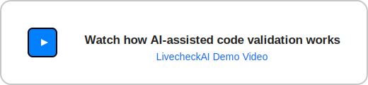

  

  
  
  
  

<h3 align="center">Welcome to Quality Clouds on GitHub</h3>

  <b>Governing software logic — whether written by humans or AI — ensuring every change is safe, compliant, and enterprise-ready from the start</b>

  

  ServiceNow · Salesforce · Microsoft Dynamics 365 · Adobe

---

### 🚀 Quick Start

| Task | Description |
|------|--------------|
|  **Full CI scan for Salesforce (Build Check Action)** | [action-full-scan](https://github.com/qualityclouds/action-full-scan) |
|  **Application scan for ServiceNow (Build Check Action)** | [action-application-scan](https://github.com/qualityclouds/action-application-scan) |
|  **Integrations & SDKs** | [qualityclouds](https://github.com/qualityclouds/qualityclouds) |
|  **Docs & Support** | [qualityclouds.com](https://qualityclouds.com) · help@qualityclouds.com |

---

### 💡 What We Do

Quality Clouds provides automated code quality and technical debt insights for enterprise cloud platforms — enabling:

- ⚡ **Faster development cycles** — with automated livechecks and clear quality gates.  
- 🧩 **Reduced incidents and technical debt** — by detecting issues before they reach production. 
- 🛡 **Improved system reliability and compliance** — through continuous governance and platform-specific best practices

We empower developers, architects, and DevOps teams to ship cleaner, safer, and more maintainable code across multiple SaaS platforms.

  

---

### 💬 Community & Help

We’re open to collaboration and feedback from developers and partners.

- 🗣️ Start a [Discussion](https://github.com/orgs/qualityclouds/discussions)
- 🐞 Report issues in any repository
- 🔐 Read our [Security Policy](https://github.com/qualityclouds/.github/blob/main/SECURITY.md)
- 🤝 View our [Code of Conduct](https://github.com/qualityclouds/.github/blob/main/CODE_OF_CONDUCT.md)
- 📖 Learn how to [Contribute](https://github.com/qualityclouds/.github/blob/main/CONTRIBUTING.md)

---

### ✨ About Quality Clouds

Quality Clouds is the governance layer for enterprise SaaS platforms — helping organizations build, deploy, and maintain applications with confidence.

We empower global teams to:
-  **Gain full visibility** into the quality, compliance, and technical debt of their cloud platforms.  
-  **Automate governance** through integrations with GitHub, ServiceNow, Salesforce, and Microsoft Dynamics 365.  
-  **Improve productivity and reliability** by catching issues before they reach production.  

With a focus on **scalability**, **security**, and **continuous improvement**, Quality Clouds supports developers, architects, and enterprise leaders in aligning code quality with business outcomes.

> “We make quality visible, measurable, and actionable — so every release is faster, safer, and smarter.”

---
🤝 [Meet our contributors](https://github.com/qualityclouds/.github/blob/main/contributors.md)

  © Quality Clouds — Built with 💚 for developers and enterprises worldwide. 
  <a href="https://qualityclouds.com">🌐 Website</a> • 
  <a href="https://www.linkedin.com/company/qualityclouds/">LinkedIn</a> • 
  <a href="https://twitter.com/qualityclouds">Twitter</a>

